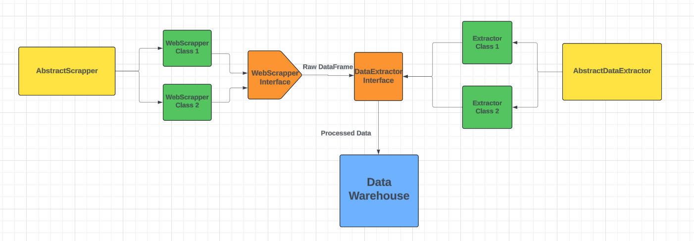

:us:

## About the Project

This project is part of the larger Intelli.gente initiative of the **Brazilian Ministry of Science and Tech (MCTI)** and of IARA Data Science research project, supported by the **São Paulo State Research foundation (FAPESP)**, and aims to **automate the collection of data from open government databases** to feed a Data Warehouse for future use in calculating indicators.

The name of the main module refers to the acronym **ETL** (Extract Transform and Load), which denotes the process that the extracted data follows before being loaded.

## Main Objectives of the Project

* **Automatic data collection**: Eliminate or minimize the need for human interference in the process of feeding the Intelli.gente and IARA databases.

* **Resilience in Collection**: Favor robust data collection methods such as APIs, and when this is not possible, use more robust WebScraping methods with less chance of becoming obsolete.

* **Historical Series**: Collect the largest and most recent historical data series available, in addition to obtaining metadata with the size and years of this series.

* **Data Processing**: Process the data according to general standards and put it in a format (data structure) that can be loaded into the Data Warehouse.

## Current Design Choices (Subject to Change):

1) Separate Classes that do WebScraping from those that extract data from the former: this was done since the logic of extracting the data file from the pages is generally quite complex, so it would be good practice to separate responsibilities in this case.

<br>

2) **Dependency Injection** of Scrapper Classes into the Classes that extract data: This OOP design pattern is quite common, it is implemented simply by passing the Scrapper class as an argument to the methods of the extractor classes, thus decoupling the two classes but allowing the same final functionality.

<br>

3) **Interfaces with Abstract Classes**: By creating Abstract classes for the purpose of scrapping a site, it is possible to create abstract methods that all its child classes need to implement. These methods are the interface of the scrapping classes and that all classes with this purpose must implement, allowing standardization of the use of these classes. The same logic was applied to the Data Extraction and Cleaning classes.

#### Diagram of the Architecture of Abstract Classes and Interfaces



## Main Modules

### Webscrapping: 

Classes that implement data extraction through webscrapping

#### Webscrapping.ScrapperClasses
Classes that do the webscrapping of official sites and return a dataframe extracted from the site, with no or very little pre-processing (only if strictly necessary)

#### Webscrapping.ExtractorClasses
Classes that receive the Scrapper classes as parameters (Dependency Injection), call the function of the Scrapper classes that return a DF and process this DF to return a data structure that represents the processed data ready to be inserted into the Database / Data Warehouse

### Api Extractor
Classes that implement data extraction through government APIs, currently only the IBGE API is supported.

### DB interface
Logic to connect the extracted data with the cloud Database/Data Warehouse for data ingestion, also has the ProcessedDataCollection class, which is the data structure that represents the data in the processed form ready to be loaded into the DB

### CityDataInfo
Module with a CSV obtained from IBGE with all municipalities in Brazil and a .py file that allows extracting all the names and codes of the municipalities from this CSV

### Config
This module has a JSON with project settings and constants (e.g., Number of data dimensions, Number of municipalities in the country, column names for the data) and a .py file created to allow retrieval of these data.


## How to Run the Project

1) Clone the repository:
```bash
git clone https://github.com/caue-paiva/intelli.gente_data_extraction
```

2) Enter the cloned project repository:

3) Create a virtual environment:
```bash
python3 -m venv intelienv
```

4) Activate the virtual environment:
```bash
source intelienv/bin/activate
```

5) Install the dependencies:
```bash
pip install -r requirements.txt
```

6) Run tests in the /test folder


## Known Issues

1) Auto-complete of python imports in VSCODE does not work with the local InteligenteEtl package

   Resolution: In the VScode settings.json file add this piece of code:

   ```json
      "python.autoComplete.extraPaths": [
         "${workspaceFolder}/InteligenteEtl"
      ]
   ```

<br>
<br>
<br>

:brazil:


## Sobre o Projeto

Esse projeto é parte maior da iniciativa **Intelli.gente do MCTI e do IARA Data Science**, com apoio da FAPESP, e visa **automatizar a coleta de dados de bases governamentais abertas** para alimentar um Data Warehouse com esses dados para serem futuramente usado nos cálculos dos indicadores.

O nome do módulo principal se refere à sigla **ETL** (Extract Transform and Load), que denota o processo que os dados extraídos seguem antes de serem carregados.

## Objetivos Principais do Projeto

* **Coleta automática de dados**: Eliminar ou reduzir ao mínimo a necessidade de interferência humana no processo de alimentar as bases do Intelli.gente e IARA

* **Resiliência na Coleta**: Favorecer métodos robustos de coleta de dados como APIs e quando isso não for possível, usar métodos de WebScrapping mais robustos e com menor chance de se tornarem obsoletos

* **Séries Históricas**: Coletar a maior e mais recente série histórica de dados disponível, além de obter os meta-dados com o tamanho e anos dessa série

* **Tratamento dos Dados**: Tratar os dados de acordo com padrões gerais e colocar eles num formato (estrutura do dado) em que ele possa ser carregado no Data Warehouse.

## Escolhas de Design atuais (Sujeito a Mudança):

1) Separar Classes que fazem o WebScrapping das que extraem os dados vindo das anteriores: isso foi feito já que a lógica de extração do arquivo de dados das páginas geramente é bem complexo, então seria uma boa prática separar as responsabilidades nesse caso.

<br>

2) **Dependency Injection** das Classes Scrapper nas Classes que extraem os dados: Esse padrão de Design em POO é bem comum , ele é implementado simplesmente passando a classe Scrapper como argum. para os métodos das classes extratoras, assim desacoplando as duas classes mas permitindo a mesma funcionalidade final.

<br>

3) **Interfaces com classes Abstratas**: Ao criar classes Abstratas para o propósito de fazer scrapping de um site é possível criar métodos abstratos que todas as classes filhas dela precisam implementar. Esses métodos são a interface das classes de scrapping e que todas as classes com esse propósito devem implementar, permitindo uma padronização do uso dessas classes. A mesma lógica foi aplicada para as classes de Extração e Limpeza dos dados.

#### Diagrama da Arquitetura das Classes Abstratas e Interfaces


## Módulos Principais

### Webscrapping: 

Classes que implementam a extração de dados por meio de webscrapping

#### Webscrapping.ScrapperClasses
Classes que fazem o webscrapping de sites oficiais e retornam um dataframe extraído do site, com nenhum ou muito pouco pre-processamento (apenas se estritamente necessário)


#### Webscrapping.ExtractorClasses
Classes que recebem as classes de Scrapper como parâmetros (Dependecy Injection), chamam a função das classes Scrapper que retornam um DF e processam esse DF para retornar uma estrutura de dados que represeta os dados processados e prontos para serem inseridos no Banco de Dados / Data Warehouse

### Api Extractor
Classes que implementam a extração de dados por meio de APIs do governo, atualmente somente a API do IBGE é suportada.

### DB interface
Lógica de conectar os dados extraídos com o Banco de Dados/Data Warehouse em nuvem para ingestão dos dados, também tem a classe ProcessedDataCollection, que é a estrutura de dados que representa os dados na forma processada e pronta para ser carregada no BD

### CityDataInfo
Módulo com um CSV obtido do IBGE com todos os municípios do Brasil e um arquivo .py que permite extrair todos os nomes e códigos dos municípios desse CSV

### Config
Esse módulo tem um JSON com configurações e constantes do projetos (Ex: Número de dimensões dos dados, Num. de municípios no país, nomes de colunas para os dados) e um arquivo .py criado para permitir a recuperação desses dados.

## Como rodar o projeto 

1) Dar git clone no repositório:
```bash
git clone https://github.com/caue-paiva/intelli.gente_data_extraction
```

2) entrar no repo clonada do projeto:

3) Criar um ambiente virtual
```bash
python3 -m venv intelienv
```

4) Ativar o ambiente virtual:
```bash
source intelienv/bin/activate
```

5) Baixar as dependências:
```bash
pip install -r requirements.txt
```

6) Realizar testes no folder /test


## Problemas conhecidos

1) Auto-complete de imports python do VSCODE não funciona com o package local do InteligenteEtl

   Resolução: No arquivo settings.json do VScode adicione esse pedaço de código:

   ```json
      "python.autoComplete.extraPaths": [
         "${workspaceFolder}/InteligenteEtl"
      ]
   ```